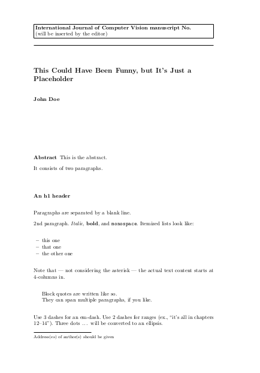

Springer Journal Markdown Template
============

Template for writing a Springer journal article entirely in Markdown. 

The template is set up to follow [International Journal of Computer Vision submission guidelines](https://www.springer.com/journal/11263/submission-guidelines).

 
[[source]](article.md), [[pdf]](article.pdf)

## Dependencies

- LaTex
- Pandoc
- [pandoc-citeproc](https://github.com/jgm/pandoc-citeproc)
- [pandoc-crossref](https://github.com/lierdakil/pandoc-crossref)
- Make

### Installation on Fedora

`sudo dnf install pandoc pandoc-citeproc make texlive-scheme-basic texlive-lm texlive-ec ` 

and place the `pandoc-citeproc` binary of the same version as `pandoc` somewhere in `PATH`

## Usage

- `make` builds pdfs from all `.md` files
- `make article.pdf` builds `article.pdf` from `article.md` 

First time:

- download citation style for your journal from https://www.zotero.org/styles/ and fix the filename in `default.yml`
- fix the journal name in `header.tex`

Customization:

- for single column layout remove `twocolumn` in `default.yml` and `-F table-filter.py \` from `PANDOC_FLAGS` in `Makefile`

## Credits

- `Makefile`: Jake Zimmerman, source: https://github.com/jez/pandoc-starter/blob/master/article/src/Makefile
- `table-filter.py`: Wagner Macedo, source: https://pastebin.com/s8wLQSJW
- Latex template: Springer, source: http://static.springer.com/sgw/documents/468198/application/zip/LaTeX_DL_468198_240419.zip
- `international-journal-of-computer-vision.csl`  [Zotero Style Repository](https://www.zotero.org/styles/)
- Thanks Mort Yao for an excellent article [Boilerplating Pandoc for Academic Writing](https://www.soimort.org/notes/161117).

## TODO

- fix newlines in `institute` / authors
- keywords are currently added to pdf metadata only